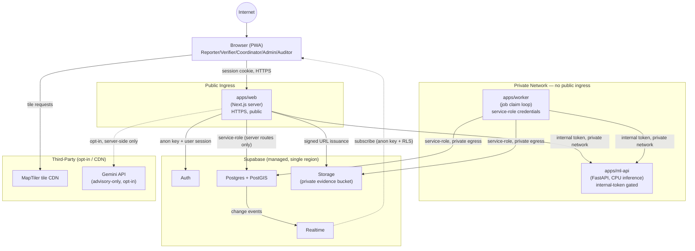

# MBOYO Deployment Topology

This describes where each component in [SYSTEM_ARCHITECTURE.md](SYSTEM_ARCHITECTURE.md) runs and how they reach each other, at the capstone/MVP scale described in [MVP_SCOPE.md](../product/MVP_SCOPE.md) and bounded by the capstone-scope gaps in [PRODUCTION_SCOPE.md](../product/PRODUCTION_SCOPE.md) (no multi-region failover).

## Environments

- **Local development** — `docker-compose.yml` runs `apps/ml-api` and `apps/worker` locally against a local or hosted Supabase project; `apps/web` runs via `next dev`.
- **Demo/staging** — a single-region deployment matching production topology but seeded with the one demo event described in [MVP_SCOPE.md](../product/MVP_SCOPE.md).
- **Production (capstone-scope)** — single-region deployment; see [PRODUCTION_SCOPE.md](../product/PRODUCTION_SCOPE.md) for the explicit statement that multi-region/DR is out of scope.

## Component Placement

- **`apps/web`** deploys as a Next.js server (Node runtime for routes needing service-role/secret access; static/edge-cacheable where the route has no privileged data) behind HTTPS. It is the only component with an internet-facing surface intended for direct end-user traffic.
- **`apps/ml-api`** deploys as a containerized FastAPI service on CPU-only infrastructure (per the CPU p95 inference latency metric in [SUCCESS_METRICS.md](../product/SUCCESS_METRICS.md)), reachable only from `apps/web` and `apps/worker` on a private network path — never exposed directly to the internet.
- **`apps/worker`** deploys as a long-running containerized process (or scheduled/always-on job) with outbound access to Supabase and `apps/ml-api`; it holds `SUPABASE_SERVICE_ROLE_KEY` and must never be reachable by inbound public traffic.
- **Supabase** (Auth, Postgres+PostGIS, Storage, Realtime) is the managed platform dependency — single region, matching the accepted risk in [RISK_REGISTER.md](../product/RISK_REGISTER.md) risk #8.
- **Map tiles** (MapTiler) are a third-party CDN dependency reached directly from the browser for tile rendering, with the non-map fallback view (risk #7) as the resilience measure — no MBOYO-operated infrastructure is in this path.
- **Gemini** (optional) is reached only from `apps/web` server-side, never from the browser and never from `apps/worker`/`apps/ml-api`, since it is a Verifier-facing advisory feature per [ADR 0004](../adr/0004-local-ml-primary-gemini-advisory.md).

## Network Boundaries

```text
Internet
   │  HTTPS
   ▼
apps/web  ── public ingress, the only internet-facing app
   │  private network / internal DNS
   ├──▶ apps/ml-api   (no public ingress; internal-token required even on the private path)
   │
   ▼
Supabase (managed, TLS) ◀── apps/worker (private egress only, no public ingress)
                        ◀── apps/ml-api (read evidence for inference, via apps/worker's fetch or its own scoped access)
```

`apps/ml-api` and `apps/worker` have no public ingress at all — this is the concrete enforcement of the BFF trust boundary described in [SYSTEM_ARCHITECTURE.md](SYSTEM_ARCHITECTURE.md): even if `ML_INTERNAL_TOKEN` were somehow guessed, the attacker would still need to reach a private network path to use it.

## Diagram 6 — Deployment



## Deployment Discipline

- No component other than `apps/web` should ever be given a public DNS entry or public ingress rule — if a future block proposes exposing `apps/ml-api` or `apps/worker` directly, that is a deviation from this document and must be justified with a new ADR, not silently implemented.
- Environment variables map to the boundaries above: only `apps/web`'s server runtime and `apps/worker` hold `SUPABASE_SERVICE_ROLE_KEY`; only `apps/web`, `apps/ml-api`, and `apps/worker` hold `ML_INTERNAL_TOKEN`; the browser bundle holds only `NEXT_PUBLIC_*` variables, per [AGENTS.md](../../AGENTS.md).
