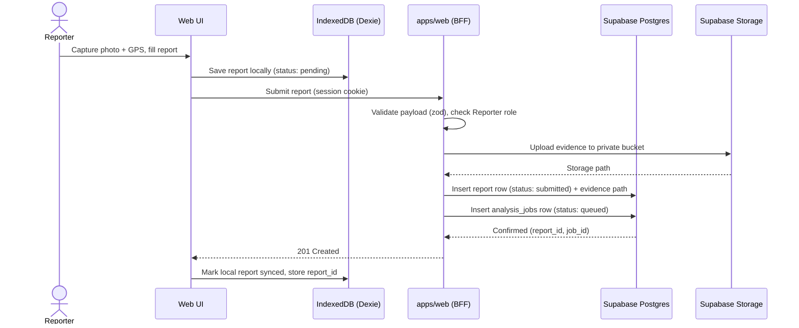
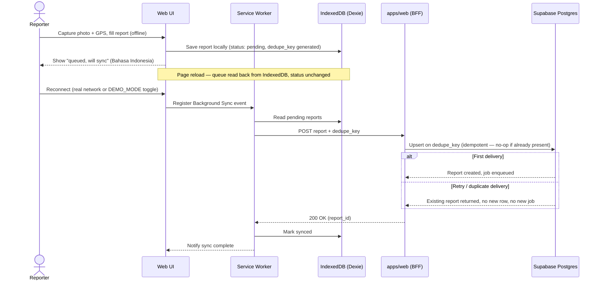
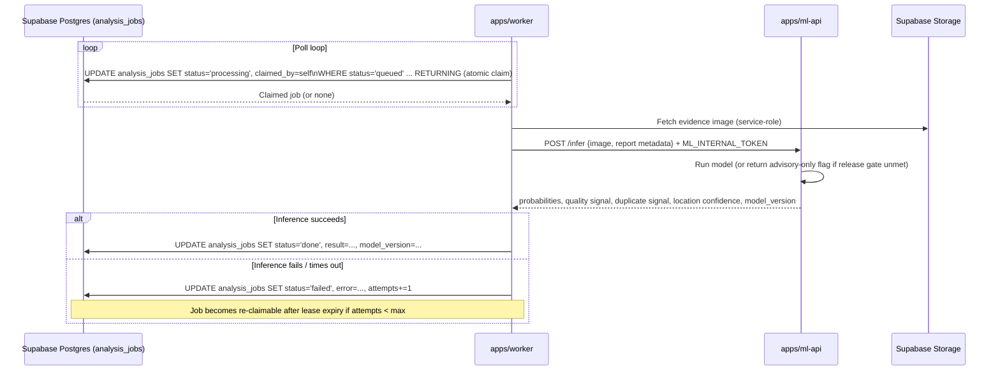
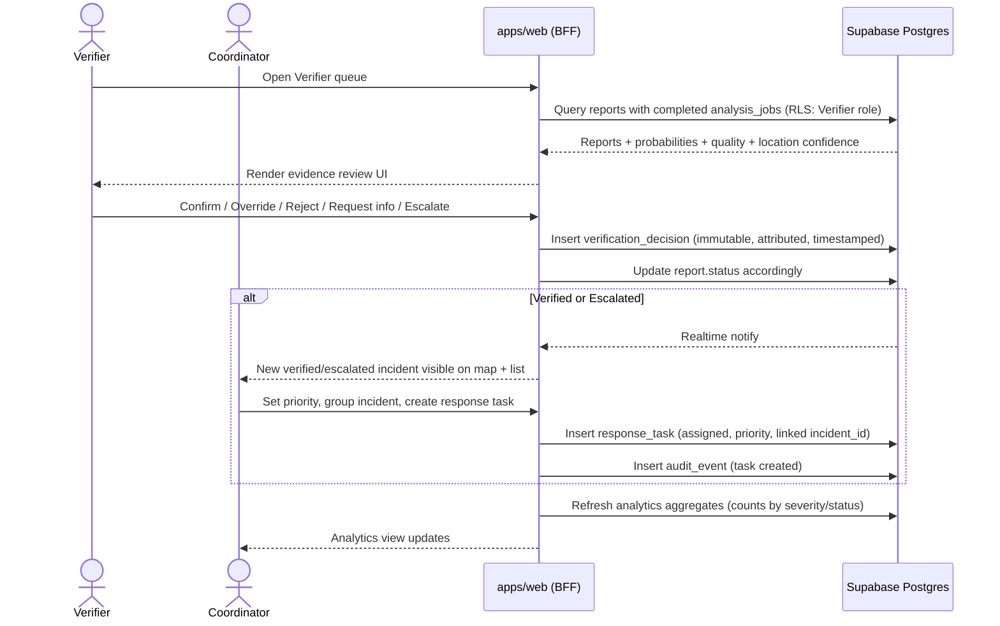

# MBOYO Sequence Flows

These diagrams trace the [MVP live flow](../product/PRODUCT_CHARTER.md#the-mvp-live-flow) at the level of concrete components from [SYSTEM_ARCHITECTURE.md](SYSTEM_ARCHITECTURE.md). Every arrow here must correspond to a real call in the implemented system — if a block deviates from these flows, this document should be updated in that block, not left stale.

## Diagram 2 — Online Report (network available at submission time)

## Diagram 3 — Offline Replay (created offline, synced later)

## Diagram 4 — Analysis Job (worker claim → inference → write-back)

## Diagram 5 — Verification to Response Task

## Diagram 6 — Deployment

See [DEPLOYMENT_TOPOLOGY.md](DEPLOYMENT_TOPOLOGY.md) for the deployment diagram and narrative.

## Cross-Cutting Notes

- Every write in these flows produces an `audit_event` row (report created, synced, job claimed/completed, verification decision, task created/assigned) so the Auditor's lineage view (per [PRODUCT_CHARTER.md](../product/PRODUCT_CHARTER.md)) is a direct query, not a reconstruction.
- Idempotency in Diagram 3 relies on a client-generated `dedupe_key` (e.g., a UUID created at report-creation time, not at sync time) so retried sync attempts — including ones that cross a reload — never create duplicate incidents.
- Diagram 4's atomic claim (`UPDATE ... RETURNING`) is what makes concurrent `apps/worker` instances safe without an external lock service — this is the core justification in [ADR 0003](../adr/0003-database-job-queue.md).
