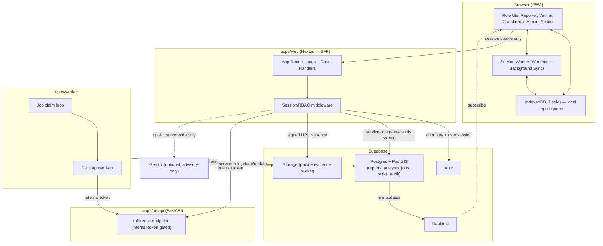

# MBOYO System Architecture

This document describes the concrete system architecture implementing the boundaries in [AGENTS.md](../../AGENTS.md) and the flow in [PRODUCT_CHARTER.md](../product/PRODUCT_CHARTER.md). It is the reference for how the five roles' capabilities are actually enforced in running software, not just policy.

## Monorepo and Build Tooling

pnpm workspaces + Turborepo. See [ADR 0001](../adr/0001-monorepo.md) for rationale. One repo holds:

- `apps/web` — Next.js App Router PWA. Serves all five role UIs and acts as the Backend-for-Frontend (BFF): it is the only component that holds a browser-facing session and mediates every privileged call to Supabase or `apps/ml-api`.
- `apps/ml-api` — FastAPI inference service. Stateless, holds no user session, trusts only requests carrying `ML_INTERNAL_TOKEN`.
- `apps/worker` — Python job worker. Polls/claims rows from the `analysis_jobs` table, calls `apps/ml-api`, writes results back. Holds Supabase service-role credentials; never exposed to the browser.
- `packages/ui` — shared React components (design-token-driven, per the brand tokens in the project's design spec).
- `packages/domain` — shared TypeScript types, Zod schemas, and domain logic (severity enums, RBAC capability tables, report/job state machines) consumed by `apps/web` and `packages/api-client`.
- `packages/api-client` — typed client wrapping calls from `apps/web` to `apps/ml-api` and to Supabase, so request/response shapes are defined once.

## Trust Boundaries

```text
Browser (Reporter/Verifier/Coordinator/Admin/Auditor UI)
   │  session cookie only — no service-role key, no ML_INTERNAL_TOKEN, no signing secrets
   ▼
apps/web (BFF, Next.js server runtime)
   │  holds SUPABASE_SERVICE_ROLE_KEY (server-only routes), ML_INTERNAL_TOKEN, SESSION_SIGNING_SECRET
   ├──▶ Supabase (Auth / Postgres+PostGIS / Storage / Realtime) — RLS enforced per role
   └──▶ apps/ml-api (internal token required)          apps/worker
                                                              │  holds SUPABASE_SERVICE_ROLE_KEY
                                                              ├──▶ analysis_jobs table (claim/lease)
                                                              ├──▶ apps/ml-api (internal token)
                                                              └──▶ Supabase Storage (private evidence bucket)
```

The browser never talks to Supabase with anything but the anon key plus the user's own RLS-scoped session, and never talks to `apps/ml-api` directly — every privileged operation is mediated by `apps/web`'s server runtime. This is the BFF pattern: it exists specifically so that role enforcement, secret custody, and request validation happen in one place instead of being re-implemented per client.

## Data Layer

- **Supabase Auth** issues sessions; role is attached via a `profiles`/`user_roles` table, not inferred from client claims alone.
- **Postgres + PostGIS** stores reports, incidents, `analysis_jobs`, response tasks, and audit events; PostGIS gives native geospatial types/queries for GPS coordinates and geofencing checks (risk #3 in the threat model).
- **Storage** holds evidence (photos) in a **private** bucket (`SUPABASE_REPORTS_BUCKET`) — never public. Access is via short-lived signed URLs issued by `apps/web` after an RLS-equivalent authorization check, and by `apps/worker`/`apps/ml-api` using service-role access for inference only.
- **Realtime** is used where the UI benefits from live updates (Verifier queue, Coordinator incident map) but is not a system-of-record — Postgres is.

## The `analysis_jobs` Database Queue

Rather than introducing a separate message broker (Redis/SQS/etc.), the job queue is a Postgres table (see [ADR 0003](../adr/0003-database-job-queue.md)):

```text
analysis_jobs
  id, report_id, status(queued|processing|done|failed),
  claimed_by, claimed_at, attempts, model_version,
  result (probabilities, quality signals, duplicate/location-confidence), error, timestamps
```

`apps/worker` claims a job with a single atomic `UPDATE ... WHERE status = 'queued' ... RETURNING` (or `FOR UPDATE SKIP LOCKED`), so multiple worker instances can run concurrently without double-processing the same report. A claimed job that isn't completed within a lease window is eligible to be re-claimed, so a crashed worker doesn't strand a job forever.

## Deterministic Demo Mode

`DEMO_MODE` / `NEXT_PUBLIC_DEMO_MODE` gate a small, explicit set of behaviors. The original scope (per [MVP_SCOPE.md](../product/MVP_SCOPE.md)) was simulating the network offline/reconnect transition via a UI toggle that exercises the *same* Dexie queue and Background Sync code path as a real network drop.

**BLOCK 21 (user-approved decision) broadened this scope by exactly one addition**: `apps/ml-api`'s `DEMO_MODE` setting permits a clearly-labeled deterministic fallback prediction when no active model artifact is loaded — never a random guess, never presented as a genuine inference result. Every fallback response carries `isDemoFallback: true` and an explicit disclaimer distinct from the `is_advisory_only` release-gate mechanism (a *loaded* model that fails its release gate returns `is_advisory_only: true` with `isDemoFallback: false`; the demo fallback only fires when there is no model loaded at all). This is still "demo mode never fabricates model probabilities" in spirit — the fallback probabilities are explicitly non-authoritative placeholders, always labeled, never silently indistinguishable from a real prediction — but it is a genuine scope change from the prior "never mocks ML inference" wording, made explicitly here rather than left as a silent contradiction between this document and AGENTS.md's general demo-fallback-labeling rule. Outside `apps/ml-api`'s no-model-loaded case, ML inference is still never mocked.

It remains implemented as a small number of feature-flag checks read at the edges (the Reporter connectivity toggle, and now `apps/ml-api`'s prediction path when no model is loaded), not scattered conditionals throughout business logic.

## External Advisory: Gemini

Gemini integration (when enabled, Production tier and later) is an explicit opt-in, called only from `apps/web` server-side, and its output is rendered strictly as labeled advisory text alongside — never in place of — the Verifier's own evidence review. See [ADR 0004](../adr/0004-local-ml-primary-gemini-advisory.md) and the Gemini threat entries in [THREAT_MODEL.md](../security/THREAT_MODEL.md).

## Diagram 1 — Components



## Related Documents

- [SEQUENCE_FLOWS.md](SEQUENCE_FLOWS.md) — the five detailed sequence diagrams.
- [DEPLOYMENT_TOPOLOGY.md](DEPLOYMENT_TOPOLOGY.md) — where each component runs.
- [THREAT_MODEL.md](../security/THREAT_MODEL.md) — attack surface analysis against this architecture.
- ADRs in [docs/adr/](../adr/) — the specific decisions this architecture embodies.
