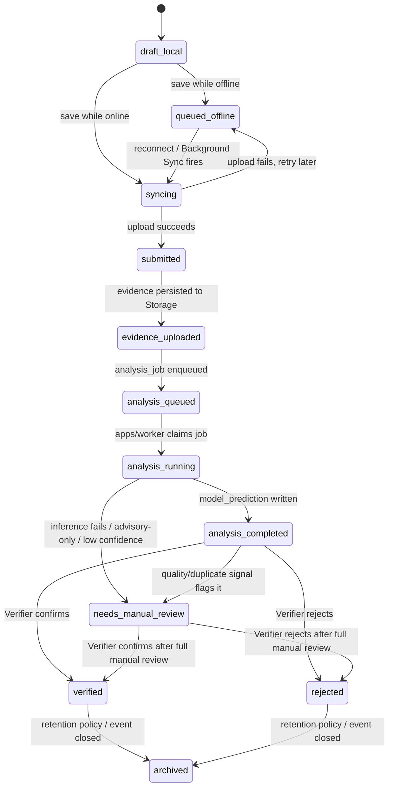
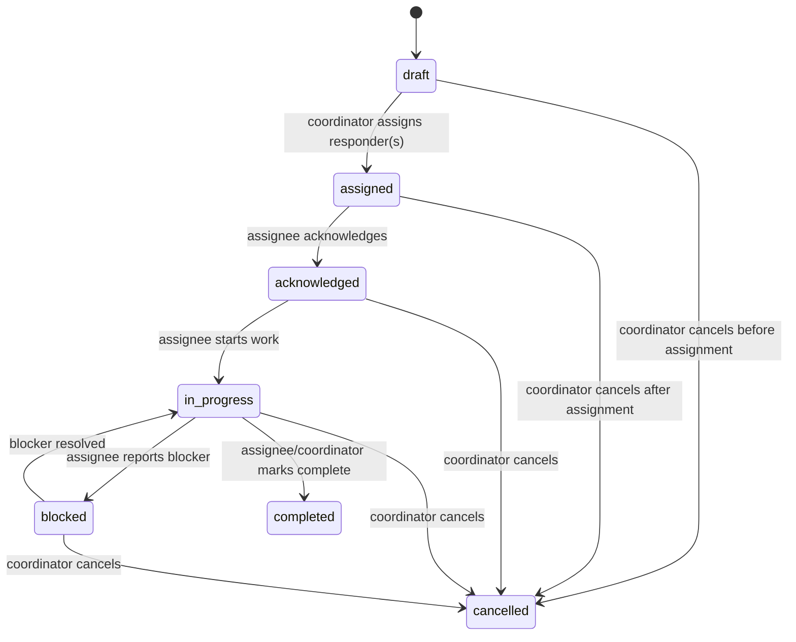

# MBOYO State Machines

This document defines the valid states and transitions for `report` and `response_task`, the two entities whose lifecycle drives the [MVP live flow](PRODUCT_CHARTER.md#the-mvp-live-flow). For every transition: **actor**, **preconditions**, **transaction result**, and **audit action** recorded to `audit_event` (see [DOMAIN_MODEL.md](DOMAIN_MODEL.md#audit_event)).

No transition below may be performed by a role not listed as its actor — this is the enforcement surface for [RBAC_MATRIX.md](RBAC_MATRIX.md) as applied specifically to lifecycle changes, and must be mirrored by RLS policy in a later block, not just checked in application code.

## Report State Machine

States: `draft_local`, `queued_offline`, `syncing`, `submitted`, `evidence_uploaded`, `analysis_queued`, `analysis_running`, `analysis_completed`, `needs_manual_review`, `verified`, `rejected`, `archived`.

### `draft_local → queued_offline`
- **Actor:** Reporter (client-side, no server round-trip).
- **Preconditions:** Report form has required fields (photo, GPS or explicit low-confidence flag) captured; device is offline at save time.
- **Transaction result:** Row created only in local IndexedDB (Dexie) — no server-side row exists yet.
- **Audit action:** None server-side (nothing to audit yet — the report doesn't exist in the system of record). Client-local event may be logged for the Reporter's own queue UI only.

### `draft_local → syncing`
- **Actor:** Reporter (client-side).
- **Preconditions:** Device is online at save time.
- **Transaction result:** Local row marked `syncing`; sync request sent immediately.
- **Audit action:** None yet (still pre-server).

### `queued_offline → syncing`
- **Actor:** System (service worker via Background Sync), triggered by reconnect — not a human action.
- **Preconditions:** Network connectivity restored; Background Sync event fires (or fallback `online` listener per [ADR 0005](../adr/0005-offline-indexeddb-workbox.md)).
- **Transaction result:** Local row status updated to `syncing`; sync POST attempted.
- **Audit action:** None yet (still pre-server; first server-side audit event is recorded on successful `submitted` transition).

### `syncing → submitted`
- **Actor:** System (`apps/web` BFF processing the sync request).
- **Preconditions:** Valid Reporter session; payload passes schema validation; `dedupe_key` not already present (or upsert is a no-op if it is, per [SEQUENCE_FLOWS.md](../architecture/SEQUENCE_FLOWS.md) Diagram 3).
- **Transaction result:** Server-side `report` row created (or matched via `dedupe_key`) with status `submitted`.
- **Audit action:** `report.created` (actor: reporter_profile_id, detail: dedupe_key, disaster_event_id).

### `syncing → queued_offline`
- **Actor:** System (client/service worker, on failed upload).
- **Preconditions:** Upload attempt fails (network error, server 5xx).
- **Transaction result:** Local row reverts to `queued_offline`; Background Sync will retry.
- **Audit action:** None server-side (no server row was created).

### `submitted → evidence_uploaded`
- **Actor:** System (`apps/web` BFF).
- **Preconditions:** Evidence file(s) validated (type/size per [THREAT_MODEL.md](../security/THREAT_MODEL.md) threat #7) and persisted to the private Storage bucket.
- **Transaction result:** `report_evidence` row(s) created; `report.status` updated.
- **Audit action:** `report.evidence_uploaded` (actor: system, detail: storage_path count).

### `evidence_uploaded → analysis_queued`
- **Actor:** System (`apps/web` BFF, same transaction as evidence upload).
- **Preconditions:** Evidence upload succeeded.
- **Transaction result:** `analysis_job` row created with status `queued`.
- **Audit action:** `analysis_job.enqueued` (actor: system, detail: analysis_job_id).

### `analysis_queued → analysis_running`
- **Actor:** System (`apps/worker`), via the atomic claim query from [ADR 0003](../adr/0003-database-job-queue.md).
- **Preconditions:** Job status is `queued`; claim update succeeds (no other worker already claimed it).
- **Transaction result:** `analysis_job.status = processing`, `claimed_by`/`claimed_at` set.
- **Audit action:** `analysis_job.claimed` (actor: system/worker_id, detail: analysis_job_id).

### `analysis_running → analysis_completed`
- **Actor:** System (`apps/worker`, after `apps/ml-api` responds successfully).
- **Preconditions:** Inference call returns a valid result.
- **Transaction result:** `model_prediction` and `model_explanation` rows created; `analysis_job.status = done`; `report.status = analysis_completed`.
- **Audit action:** `analysis_job.completed` (actor: system, detail: model_registry_entry_id, is_advisory_only).

### `analysis_running → needs_manual_review`
- **Actor:** System (`apps/worker`).
- **Preconditions:** Inference fails after max retries, OR the model is in advisory-only state (release gate not passed, per [SUCCESS_METRICS.md](SUCCESS_METRICS.md)), OR abstention threshold triggered.
- **Transaction result:** `analysis_job.status = failed` (or `done` with `is_advisory_only = true`); `report.status = needs_manual_review`.
- **Audit action:** `report.flagged_for_manual_review` (actor: system, detail: reason).

### `analysis_completed → needs_manual_review`
- **Actor:** System (automatic, based on computed quality/duplicate signal thresholds).
- **Preconditions:** `model_prediction.quality_score` below configured threshold, or `duplicate_candidate_report_id` is set.
- **Transaction result:** `report.status = needs_manual_review`.
- **Audit action:** `report.flagged_for_manual_review` (actor: system, detail: quality_score or duplicate_candidate_report_id).

### `analysis_completed → verified` / `needs_manual_review → verified`
- **Actor:** Verifier.
- **Preconditions:** Verifier has reviewed evidence, probabilities/explanation, quality, and location confidence; issues a `confirm` or `override` decision.
- **Transaction result:** `verification_review` row created (`decision = confirm` or `override`, with `override_severity` if overriding); `report.status = verified`.
- **Audit action:** `report.verified` (actor: verifier_profile_id, detail: decision, override_severity if applicable).

### `analysis_completed → rejected` / `needs_manual_review → rejected`
- **Actor:** Verifier.
- **Preconditions:** Verifier determines the report is invalid, fake, or a true duplicate (per [THREAT_MODEL.md](../security/THREAT_MODEL.md) threats #1–2).
- **Transaction result:** `verification_review` row created (`decision = reject`); `report.status = rejected`.
- **Audit action:** `report.rejected` (actor: verifier_profile_id, detail: notes).

### `analysis_completed → needs_manual_review` / `needs_manual_review → needs_manual_review` (insufficient evidence, BLOCK 23)
- **Actor:** Verifier.
- **Preconditions:** Verifier judges the evidence itself (photo quality/count) cannot support any decision at all — distinct from `request_info`, which asks the Reporter a specific clarifying question; this decision makes no assumption about what additional evidence would help.
- **Transaction result:** `verification_review` row created (`decision = insufficient_evidence`); `report.status` remains/becomes `needs_manual_review`.
- **Audit action:** `report.insufficient_evidence` (actor: verifier_profile_id, detail: notes).

### `verified → archived` / `rejected → archived`
- **Actor:** System (scheduled retention job) or System Administrator (manual, per configured retention policy in [PRODUCTION_SCOPE.md](PRODUCTION_SCOPE.md)).
- **Preconditions:** Retention period elapsed, or disaster_event closed.
- **Transaction result:** `report.status = archived`; raw evidence lifecycle applied per retention policy (may include evidence deletion while the report/audit record itself is retained).
- **Audit action:** `report.archived` (actor: system or admin_profile_id, detail: retention_policy_id).

### Escalation (not a status transition, an annotation on `needs_manual_review`/`analysis_completed`)
- **Actor:** Verifier, escalating to senior review (Enhanced Demo tier per [MVP_SCOPE.md](MVP_SCOPE.md)).
- **Preconditions:** Verifier judges the case requires senior review before a final decision.
- **Transaction result:** `verification_review` row created (`decision = escalate`); `report.status` remains `needs_manual_review` but is flagged `escalated = true` for Coordinator/senior-Verifier surfacing.
- **Audit action:** `report.escalated` (actor: verifier_profile_id, detail: notes).

## Task State Machine

States: `draft`, `assigned`, `acknowledged`, `in_progress`, `blocked`, `completed`, `cancelled`.

### `[*] → draft`
- **Actor:** Response Coordinator.
- **Preconditions:** A `report` (or `incident_cluster`) has `status = verified`; Coordinator initiates task creation.
- **Transaction result:** `response_task` row created (`status = draft`, `priority` per [Priority Levels](#priority-levels)).
- **Audit action:** `response_task.created` (actor: coordinator_profile_id, detail: report_id/incident_cluster_id, priority).

### `draft → assigned`
- **Actor:** Response Coordinator.
- **Preconditions:** Task exists in `draft`; at least one assignee selected.
- **Transaction result:** `task_assignment` row(s) created; `response_task.status = assigned`.
- **Audit action:** `response_task.assigned` (actor: coordinator_profile_id, detail: assignee_profile_id).

### `assigned → acknowledged`
- **Actor:** The assignee (a Response Coordinator-role user acting as assignee, or a designated responder account within that role scope — MBOYO does not introduce a sixth role for field responders at MVP; assignment is to a Coordinator-role profile).
- **Preconditions:** Task is `assigned` to this profile.
- **Transaction result:** `response_task.status = acknowledged`.
- **Audit action:** `response_task.acknowledged` (actor: assignee_profile_id).

### `acknowledged → in_progress`
- **Actor:** The assignee.
- **Preconditions:** Task is `acknowledged`.
- **Transaction result:** `response_task.status = in_progress`.
- **Audit action:** `response_task.started` (actor: assignee_profile_id).

### `in_progress → blocked`
- **Actor:** The assignee.
- **Preconditions:** Task is `in_progress`; a blocker is reported.
- **Transaction result:** `response_task.status = blocked`; blocker reason recorded.
- **Audit action:** `response_task.blocked` (actor: assignee_profile_id, detail: reason).

### `blocked → in_progress`
- **Actor:** The assignee or Response Coordinator.
- **Preconditions:** Task is `blocked`; blocker resolved.
- **Transaction result:** `response_task.status = in_progress`.
- **Audit action:** `response_task.unblocked` (actor: profile_id, detail: resolution).

### `in_progress → completed`
- **Actor:** The assignee or Response Coordinator.
- **Preconditions:** Task is `in_progress`; work is done.
- **Transaction result:** `response_task.status = completed`, `closed_at` set.
- **Audit action:** `response_task.completed` (actor: profile_id).

### `{draft, assigned, acknowledged, in_progress, blocked} → cancelled`
- **Actor:** Response Coordinator exclusively (an assignee cannot cancel their own task — only the Coordinator who owns dispatch authority per [AGENTS.md](../../AGENTS.md)).
- **Preconditions:** Task is not already `completed` or `cancelled`.
- **Transaction result:** `response_task.status = cancelled`, `closed_at` set, reason recorded.
- **Audit action:** `response_task.cancelled` (actor: coordinator_profile_id, detail: reason).

## Priority Levels

`unassigned`, `low`, `medium`, `high`, `critical` — a property on `response_task` (and optionally `incident_cluster`), settable and re-settable only by Response Coordinator, at any point before `completed`/`cancelled`. Priority changes are not a state-machine transition (they don't gate what happens next) but are still audited:

- **Actor:** Response Coordinator.
- **Preconditions:** Task/cluster is not `completed` or `cancelled`.
- **Transaction result:** `response_task.priority` (or `incident_cluster.priority`) updated.
- **Audit action:** `response_task.priority_changed` (actor: coordinator_profile_id, detail: old_priority, new_priority).

Priority is never set by the Verifier or derived automatically from `model_prediction` severity alone — severity is an input the Coordinator considers, but priority-setting is an operational judgment reserved to the Coordinator role per [AGENTS.md](../../AGENTS.md) ("Forbidden: setting response priority" for Reporter and Verifier).
